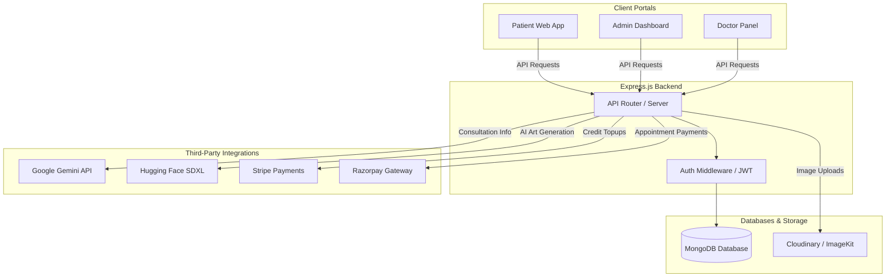

# Prescripito 🩺

Prescripito is a comprehensive, modern healthcare platform and clinic appointment booking system featuring an integrated **AI Assistant** (for medical queries and image generation), a dedicated **Admin Dashboard**, and a **Doctor Portal**.

Built on the MERN stack, the application splits into three decoupled components:
1. **Frontend (Patient Portal)**: A sleek, interactive React web app for patients to find doctors, book appointments, make payments, and access the AI Assistant.
2. **Admin & Doctor Panel**: A React web app providing complete operational oversight for administrators (managing doctors, checking reports) and doctor-specific dashboards (managing appointment logs, updating profile fees/availability).
3. **Backend API**: An Express.js server utilizing MongoDB/Mongoose, integrated with payment gateways (Stripe, Razorpay), cloud storage (Cloudinary, ImageKit), and AI APIs (Google Gemini, Hugging Face).

---

## 🏗️ System Architecture

The workflow and communication channels between components are illustrated below:



---

## 🌟 Key Features

### 1. Patient Portal (Frontend)
- **User Authentication**: Secure signup and login with profile management (editable address, birthday, gender, and profile photo uploads).
- **Doctor Discovery**: Interactive filtering of doctors by specialities (General Physician, Gynecologist, Dermatologist, Pediatrician, Neurologist, Gastroenterologist).
- **Slot-Booking System**: Appointment booking with interactive date picker and hourly slot selection.
- **Appointment Registry**: Track appointment history, cancel bookings, and complete checkout.
- **Payment Gateways**: Direct payment support using **Razorpay** for consultations.
- **🤖 Health AI Assistant**:
  - **Text Chat**: Get informational, educational wellness answers (powered by Gemini API). Costs 1 credit.
  - **Image Generator**: Create custom health diagrams or descriptive images using Stable Diffusion XL. Costs 2 credits.
  - **Stripe Subscriptions**: Purchase Credit packs (Basic, Pro, Premium) to replenish assistant credits.
  - **Community Page**: Browse public artwork/diagrams shared by other patients in the community.

### 2. Admin Portal
- **Dashboard Overview**: View system statistics including total registered doctors, booked appointments, and unique users, along with recent booking history.
- **Doctor Management**: Onboard new doctors with profile photos, specialities, education, consultation fees, and experience details.
- **Availability Toggle**: Easily toggle doctor availability, instantly syncing with client searches on the patient portal.
- **Appointment Actions**: Track and cancel scheduling requests system-wide.

### 3. Doctor Portal
- **Doctor Dashboard**: View summary of personal earnings, total appointments, list of unique patients, and chronological list of bookings.
- **Booking Management**: Mark appointments as complete or cancel appointments.
- **Profile Configuration**: Set consultant fees, update clinics/offices, change availability, and configure personal timing slots.

---

## 🛠️ Tech Stack & Core Dependencies

### Backend
- **Core Platform**: Node.js & Express.js
- **Database**: MongoDB & Mongoose
- **Image Cloud Storage**: Cloudinary (profile uploads) & ImageKit (AI image assets)
- **Gateways**: Stripe SDK & Razorpay SDK
- **AI Integrations**: Google Generative AI (`gemini-2.0-flash` endpoint) & Hugging Face Hub API (Stable Diffusion XL)
- **Security & Utilities**: JSON Web Token (JWT) auth, BCrypt, Multer (multipart form handling), Svix (webhook verification), and Validator.

### Frontends (Patient & Admin)
- **UI Framework**: React 19 (Vite build system)
- **Styling**: Tailwind CSS v4
- **Routing**: React Router DOM v7
- **Toasts**: React Toastify & React Hot Toast

---

## 📁 Repository Structure

```text
Prescripito/
├── backend/                  # Node.js Server & APIs
│   ├── config/               # Database and API clients (Mongoose, Cloudinary, ImageKit)
│   ├── controllers/          # Request handling logic (Admin, Doctor, Patient, Chat, Payments)
│   ├── middlewares/          # JWT check & multer configurations
│   ├── models/               # MongoDB models (User, Doctor, Appointment, Chat, Transaction)
│   ├── routes/               # API endpoints
│   ├── server.js             # Main server entrypoint
│   └── package.json
│
├── frontend/                 # Patient Portal Web App
│   ├── src/
│   │   ├── assets/           # UI media, logos, and icons
│   │   ├── components/       # UI Components (Navbar, Chatbox, SpecialityMenu, etc.)
│   │   ├── context/          # React Context (Appcontext, Chatcontext)
│   │   ├── pages/            # View pages (Home, Appointment, AI, Login, Myprofile)
│   │   └── main.jsx
│   └── package.json
│
└── admin/                    # Admin & Doctor Dashboard Web App
    ├── src/
    │   ├── components/       # Sidebars and topbars
    │   ├── context/          # Combined context state managers
    │   ├── pages/
    │   │   ├── Admin/        # Admin routes (Dashboard, AddDoctor, AllAppointments)
    │   │   └── Doctors/      # Doctor routes (DoctorDashboard, DoctorProfile, Appointments)
    │   └── main.jsx
    └── package.json
```

---

## ⚙️ Configuration Setup

Before running the application, create `.env` files in each service directory.

### 🔑 Backend Configuration (`backend/.env`)
Create a file at `backend/.env` containing:
```env
PORT=4000
MONGODB_URI=your_mongodb_connection_string
JWT_SECRET_KEY=your_jwt_signing_key

# Admin Default Credentials
ADMIN_EMAIL=admin@prescripto.com
ADMIN_PASSWORD=AdminPassword123

# Cloudinary Storage
CLOUDINARY_CLOUD_NAME=your_cloudinary_cloud_name
CLOUDINARY_API_KEY=your_cloudinary_api_key
CLOUDINARY_API_SECRET=your_cloudinary_api_secret

# ImageKit Storage (AI Images)
IMAGEKIT_PUBLIC_KEY=your_imagekit_public_key
IMAGEKIT_PRIVATE_KEY=your_imagekit_private_key
IMAGEKIT_URL_ENDPOINT=your_imagekit_url_endpoint

# Payment Integrations
STRIPE_SECRET_KEY=your_stripe_secret_key
STRIPE_WEBHOOK_KEY=your_stripe_webhook_signing_key
RAZORPAY_KEY_ID=your_razorpay_key_id
RAZORPAY_SECRET=your_razorpay_secret

# AI Models (Google Gemini & Hugging Face)
GEMINI_API_KEY=your_gemini_api_key
HF_API_KEY=your_huggingface_api_token
```

### 🔑 Patient Portal Configuration (`frontend/.env`)
Create a file at `frontend/.env` containing:
```env
VITE_BACKEND_URL=http://localhost:4000
VITE_RAZORPAY_KEY_ID=your_razorpay_key_id
```

### 🔑 Admin Portal Configuration (`admin/.env`)
Create a file at `admin/.env` containing:
```env
VITE_BACKEND_URL=http://localhost:4000
```

---

## 🚀 Running the Application

Follow these steps to run all three services locally:

### Step 1: Clone and Install Dependencies
Navigate into each directory and install packages:

```bash
# Install backend packages
cd backend
npm install

# Install patient portal packages
cd ../frontend
npm install

# Install admin/doctor portal packages
cd ../admin
npm install
```

### Step 2: Start the Development Servers

Use separate terminal terminals or tabs to run the services:

#### 1. Launch Backend API
```bash
cd backend
npm run server
# Server boots up on http://localhost:4000
```

#### 2. Launch Patient Web App
```bash
cd frontend
npm run dev
# App boots up on http://localhost:5173 (or next free port)
```

#### 3. Launch Admin/Doctor Control Panel
```bash
cd admin
npm run dev
# App boots up on http://localhost:5174 (or next free port)
```

---

> [!IMPORTANT]
> **Health Information Disclaimer**: The integrated AI Assistant is meant strictly for educational and wellness informational support. It does not perform diagnoses, prescribe medications, or replace formal medical consultations. Always seek professional advice for any health conditions.
