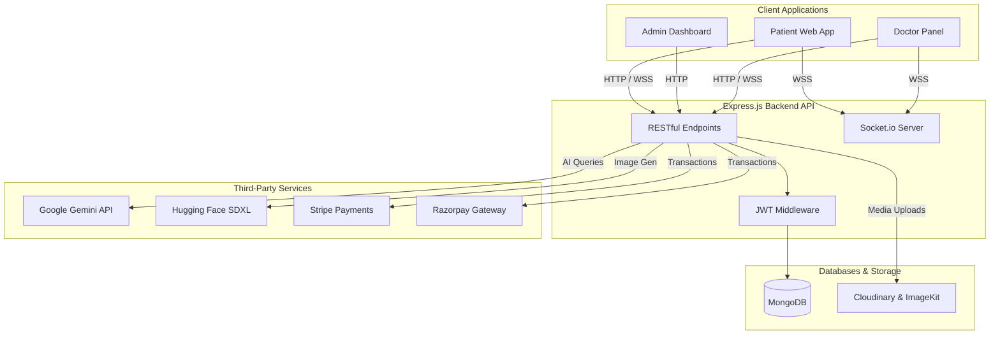

<div align="center">
  
  
  # 🩺 Prescripito
  
  **The Next-Generation Telemedicine & Appointment Booking Platform**

  <p align="center">
    <a href="https://prescripito.vercel.app" target="_blank">
      
    </a>
    <a href="https://prescripito-rfln.vercel.app/" target="_blank">
      
    </a>
  </p>

  [](https://reactjs.org/)
  [](https://nodejs.org/)
  [](https://www.mongodb.com/)
  [](https://socket.io/)
  [](https://deepmind.google/technologies/gemini/)
  
  <br />
  <em>Bridging the gap between patients and medical professionals with real-time consultations, AI assistance, and seamless bookings.</em>
</div>

<br />

> **🎓 Academic Project Note:** This project was developed as a comprehensive Final Year College Assignment to demonstrate mastery over full-stack web development (MERN), real-time communication protocols (WebSockets), Payment Gateway integrations, and modern AI API capabilities.

## 📖 Table of Contents
- [About the Project](#-about-the-project)
- [System Architecture](#-system-architecture)
- [Key Features](#-key-features)
  - [Patient Portal](#1-patient-portal-frontend)
  - [Doctor Portal](#2-doctor-portal)
  - [Admin Panel](#3-admin-portal)
- [Tech Stack](#-tech-stack)
- [Installation & Setup](#-installation--setup)
- [Environment Variables](#-environment-variables)
- [Disclaimer](#-disclaimer)

---

## 🚀 About the Project

**Prescripito** is a modern healthcare platform that bridges the gap between patients and medical professionals. It eliminates the hassle of physical clinic queues by providing a seamless, digital-first experience for booking appointments, consulting with doctors in real-time, and receiving digital prescriptions. 

Additionally, it integrates a smart **AI Health Assistant** to empower patients with preliminary health education and visual anatomical references.

---

## 🏗️ System Architecture

The application is built using a micro-frontend-like architecture, decoupled into three distinct services communicating via a centralized REST API and WebSockets.


```mermaid
graph TD
    %% Portals
    subgraph Clients ["Client Applications"]
        P["Patient Web App"]
        A["Admin Dashboard"]
        D["Doctor Panel"]
    end

    %% Backend Service
    subgraph Server ["Express.js Backend API"]
        API["RESTful Endpoints"]
        WS["Socket.io Server"]
        Auth["JWT Middleware"]
    end

    %% Databases
    subgraph Data ["Databases & Storage"]
        DB[("MongoDB")]
        Cloud["Cloudinary & ImageKit"]
    end

    %% External Services
    subgraph Integrations ["Third-Party Services"]
        Gemini["Google Gemini API"]
        HF["Hugging Face SDXL"]
        Stripe["Stripe Payments"]
        Razorpay["Razorpay Gateway"]
    end

    %% Communication Flows
    P -->|"HTTP / WSS"| API
    P -->|"WSS"| WS
    A -->|"HTTP"| API
    D -->|"HTTP / WSS"| API
    D -->|"WSS"| WS
    
    API --> Auth
    Auth --> DB
    
    API -->|"Media Uploads"| Cloud
    API -->|"AI Queries"| Gemini
    API -->|"Image Gen"| HF
    API -->|"Transactions"| Stripe
    API -->|"Transactions"| Razorpay
```

---

## ✨ Key Features

### 1. Patient Portal (Frontend)
Designed with a focus on User Experience (UX) and accessibility.
*   **Authentication & Profiles:** Secure JWT-based login with profile photo uploads and personal detail management.
*   **Smart Discovery:** Filter doctors dynamically based on specialities (e.g., Neurologist, Dermatologist, Pediatrician).
*   **Real-Time Telemedicine Chat:** A built-in WhatsApp-like chat allowing patients to text doctors and instantly upload medical reports (PDFs) or X-rays (Images).
*   **Seamless Booking & Payments:** Interactive slot selection integrated directly with **Razorpay** for secure, one-click checkouts.
*   **🤖 AI Health Assistant:**
    *   **Medical Chatbot:** Ask wellness questions and get intelligent answers powered by Google's Gemini API.
    *   **Medical Image Generator:** Generate visual health references using Hugging Face Stable Diffusion XL.
    *   **Credit System:** Monetized via **Stripe** subscriptions (Basic, Pro, Premium tiers) for AI usage.

### 2. Doctor Portal
A dedicated workspace for medical professionals to manage their virtual clinic.
*   **Virtual Consultation Room:** Engage with patients via Real-Time Chat. View patient-uploaded reports securely.
*   **Auto-Generate Digital Prescriptions:** An advanced built-in tool where doctors input *Symptoms*, *Diagnosis*, and *Medicines*. The system instantly renders a professional PDF Prescription and delivers it to the patient.
*   **Revenue & Metrics Dashboard:** Track total appointments, unique patients, and overall earnings visually.
*   **Availability Management:** Instantly mark profiles as available or unavailable, immediately reflecting on the patient app.

### 3. Admin Portal
A centralized control room for hospital administrators.
*   **System Analytics:** High-level dashboard showcasing total platform revenue, registered doctors, and overall user engagement.
*   **Doctor Onboarding:** Securely add new doctors, set their consultation fees, assign specialities, and upload their credentials.
*   **Global Oversight:** View and manage all appointments happening across the platform in real-time.

---

## 🛠️ Tech Stack

### Frontend Architecture
*   **Library:** React 19
*   **Build Tool:** Vite
*   **Styling:** Tailwind CSS v4 & Glassmorphism UI principles
*   **Routing:** React Router DOM v7
*   **State Management:** React Context API
*   **Real-Time:** Socket.io-client
*   **PDF Generation:** jsPDF & jspdf-autotable

### Backend Architecture
*   **Runtime:** Node.js
*   **Framework:** Express.js
*   **Database:** MongoDB with Mongoose ODM
*   **Authentication:** JSON Web Tokens (JWT) & bcrypt for password hashing
*   **Real-Time Engine:** Socket.io
*   **File Handling:** Multer & Cloudinary SDK

### Third-Party APIs
*   **Payments:** Stripe (Credit Top-ups) & Razorpay (Consultation Fees)
*   **Artificial Intelligence:** Google Gemini (`gemini-2.0-flash`) & Hugging Face (`Stable-Diffusion-XL`)

---

## 💻 Installation & Setup

Follow these steps to run the project locally on your machine.

### Prerequisites
*   Node.js (v18+)
*   MongoDB Instance (Local or Atlas)
*   API Keys for Stripe, Razorpay, Cloudinary, and Gemini.

### 1. Clone the Repository
```bash
git clone https://github.com/your-username/Prescripito.git
cd Prescripito
```

### 2. Install Dependencies
You must install the NPM packages for all three workspaces:
```bash
# Backend
cd backend && npm install

# Patient Frontend
cd ../frontend && npm install

# Admin/Doctor Dashboard
cd ../admin && npm install
```

### 3. Start the Development Servers
Open three separate terminal windows/tabs:

**Terminal 1 (Backend):**
```bash
cd backend
npm run server
# Runs on http://localhost:4000
```

**Terminal 2 (Patient Portal):**
```bash
cd frontend
npm run dev
# Runs on http://localhost:5173
```

**Terminal 3 (Admin Portal):**
```bash
cd admin
npm run dev
# Runs on http://localhost:5174
```

---

## 🔐 Environment Variables

You need to create `.env` files in the respective directories.

### `backend/.env`
```env
PORT=4000
MONGODB_URI=your_mongodb_connection_string
JWT_SECRET_KEY=your_jwt_signing_key

# Admin Default Credentials
ADMIN_EMAIL=admin@prescripto.com
ADMIN_PASSWORD=AdminPassword123

# Cloudinary Storage
CLOUDINARY_CLOUD_NAME=your_cloudinary_cloud_name
CLOUDINARY_API_KEY=your_cloudinary_api_key
CLOUDINARY_API_SECRET=your_cloudinary_api_secret

# ImageKit Storage (AI Images)
IMAGEKIT_PUBLIC_KEY=your_imagekit_public_key
IMAGEKIT_PRIVATE_KEY=your_imagekit_private_key
IMAGEKIT_URL_ENDPOINT=your_imagekit_url_endpoint

# Payment Integrations
STRIPE_SECRET_KEY=your_stripe_secret_key
STRIPE_WEBHOOK_KEY=your_stripe_webhook_signing_key
RAZORPAY_KEY_ID=your_razorpay_key_id
RAZORPAY_SECRET=your_razorpay_secret

# AI Models (Google Gemini & Hugging Face)
GEMINI_API_KEY=your_gemini_api_key
HF_API_KEY=your_huggingface_api_token
```

### `frontend/.env`
```env
VITE_BACKEND_URL=http://localhost:4000
VITE_RAZORPAY_KEY_ID=your_razorpay_key_id
```

### `admin/.env`
```env
VITE_BACKEND_URL=http://localhost:4000
```

---

## ⚠️ Disclaimer
> **Health Information Disclaimer:** The integrated AI Assistant is meant strictly for educational and wellness informational support. It does not perform diagnoses, prescribe medications, or replace formal medical consultations. The platform built is purely for academic demonstration. Always seek professional advice for any health conditions.
